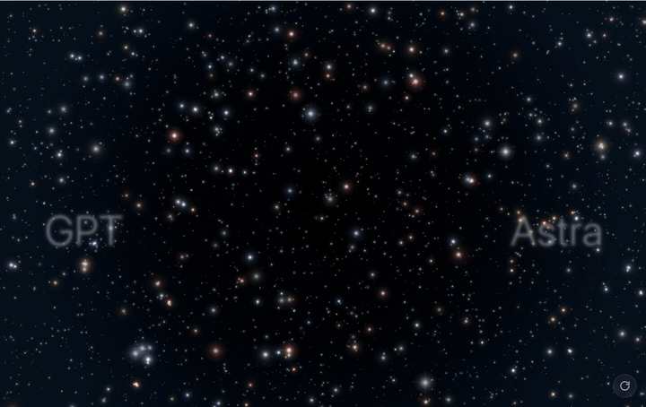

# GPT-6 Astra · 星空螺旋 "6"

**[English](README_EN.md) | 简体中文**

复刻 OpenAI [GPT-6 Astra 发布页](https://openai.com/index/gpt-6-astra/)的星空背景动效：数千颗星辰从随机散布汇聚成螺旋星系 "6"，滚动驱动 3D 相机倾斜，鼠标与星星有力场交互，继续滚动星系裂成两半散向两侧。



## ⚠️ 复刻说明（先读）

本项目是**学习性质的非官方复刻**，与官网存在已知的差异：

- **旋臂路径不是完美复刻**：五条旋臂的平面轨迹是根据官网截图用自带的画板工具手工描摹的，整体形态接近，但逐点的曲率、间距与官网原版的精确路径并不一致
- **星星颜色不是完美复刻**：星辰配色（7 色高亮调色板及其比例）是肉眼比对官网调校的近似值，并非取自官网的真实色值
- 3D 高度剖面、动画时序、交互手感同样为近似还原

## ✨ 特性

- **汇聚动画**：满屏散星沿 S 形 / 逆时针圆弧路径（可切换）汇聚成螺旋 "6"
- **伪 3D 旋臂**：5 条旋臂各有独立的高度剖面（Z 曲线），俯视时与 2D 逐像素一致，倾斜时呈现立体穿插
- **滚动驱动相机**：向下滚动，视角从垂直俯视平滑倾斜至 35°（纯页面滚动，无劫持）
- **鼠标力场**：划过星星时施加"来拒去留"的力（沿鼠标速度方向），弹簧缓慢归位
- **拖动旋转**：汇聚完成后按住拖动可任意角度翻转星系（四元数轨迹球，无奇点），松手最短弧回位
- **分裂转场**：过阈值继续滚动——星系裂成两个半密度旋臂向两侧移动，同时离散度增加，最终溶解为两侧均匀星群，两侧文字同步淡出
- **中心光团**：70 个白色光晕球聚集、缓慢自转，各自独立响应鼠标力
- **背景星野**：带深度分层的视差视差，分裂时同步退到两侧
- **零依赖**：纯 Canvas 2D + 原生 JS，无构建步骤

## 🚀 快速开始

无需安装任何东西，直接用浏览器打开：

```bash
open index.html        # macOS
# 或直接双击 index.html
```

## 🎮 交互

| 操作 | 效果 |
|---|---|
| 页面加载 | 散星 → 汇聚成 "6" → 持续流动，星星汇入中心光团后重生 |
| 鼠标划过 | 星星沿鼠标速度方向被推开 / 拖带，松开后弹回原轨 |
| 向下滚动 | 相机从俯视逐渐倾斜至 35°，旋臂立体层次显现 |
| 汇聚后按住拖动 | 任意角度旋转星系，松手平滑回位（拖动光标提示） |
| 滚过阈值继续滚 | 星系裂成两半移向两侧 → 离散溶解为均匀星群，文字淡出 |
| 右下角按钮 | 重播动画 |

## 🎛 调参指南

所有关键参数都有注释，直接改文件刷新即可：

**`js/arms-data.js` — `CFG`**

| 参数 | 含义 |
|---|---|
| `flowPeriod: [40, 60]` | 星星沿臂流动周期（秒），越大越慢 |
| `flowDensity: 0.39` | 流动星密度 |
| `bandHalf / bandHalfY` | 旋臂平面宽度 / 垂直厚度 |
| `bgStars: 700` | 背景星数量 |
| `STAR_COLORS` | 7 色调色板与权重 |

**`js/app.js` — 顶部常量**

| 参数 | 含义 |
|---|---|
| `GATHER_MODE` | `'s'` S 形汇聚 / `'arc'` 圆弧汇聚 |
| `CAM_MOVE.elEnd` | 滚动极限俯仰角（当前 35°） |
| `SPLIT.*` | 分裂转场的全部参数（平移幅度、离散倍数、两侧区域、滞后、弧线） |
| `MOUSE.*` | 鼠标力场（推力/拖带/半径/弹簧/偏移上限） |
| `CORE_SPIN` | 中心光团自转速度 |
| `BG_DRAG_FORCE` | 拖动旋转时背景星是否仍受鼠标力 |

## 🛠 配套工具（`tools/`）

本项目的数据不是手写坐标，而是用自研工具"画"出来的：

| 工具 | 用途 |
|---|---|
| `tools/draw-arms/` | **旋臂画板**：参考图叠加描摹旋臂平面路径，自动拟合为样条控制点；支持续画、拖点编辑、导入现有数据、导出 `arms-data.js` |
| `tools/z-editor/` | **高度编辑器**：9 个站点上下拖动调整每条臂的高度剖面，3D 预览实时联动，导出 `arms-3d.js` |
| `tools/3d-viewer/` | **3D 预览器**：轨道相机查看旋臂空间关系，z0/k 滑条调参 |

## 🧠 实现原理（简）

- **旋臂**：控制点 + 向心 Catmull-Rom 样条 + 弧长参数化；星星沿臂流动，法线方向高斯散布形成有宽度的星带
- **伪 3D**：世界坐标（设计稿 XY → 世界 XZ 平面，Z 编辑器数据 → 世界 Y 高度）+ 逐点透视投影，俯视时与 2D 逐像素对齐
- **相机**：四元数轨迹球（避免欧拉角天顶点退化），滚动设定目标朝向，拖动增量旋转，松手 slerp 最短弧回位
- **鼠标力**：屏幕空间弹簧模型，力方向 = 鼠标速度方向（前方推开、后方拖带），避免 360° 径向力扫出圆形空洞
- **分裂转场**：两阶段叠加——归属侧整体平移（保持螺旋形状）+ 离散度 sqrt 曲线增长 + 逐星滞后的槽位溶解

## 📁 结构

```
├── index.html          # 页面（左右大字 + 重播按钮 + 滚动占位）
├── css/style.css
├── js/
│   ├── app.js          # 主引擎（粒子系统/交互/渲染）
│   ├── cam3d.js        # 3D 相机（四元数轨迹球 + 透视投影）
│   ├── arms-data.js    # 旋臂平面数据 + CFG 配置
│   ├── arms-3d.js      # 旋臂高度剖面数据
│   └── zcurve.js       # Z 曲线插值（引擎与编辑器共用）
└── tools/              # 画板 / 高度编辑器 / 3D 预览器
```

## ⚖️ 声明

- 本项目为**非官方**的个人学习性复刻，与 OpenAI 无任何关联
- 灵感与视觉参照来自 [openai.com/index/gpt-6-astra](https://openai.com/index/gpt-6-astra/)
- 全部代码与星空视觉均为手写实现；`tools/draw-arms/assets/` 中的两张参考图为官网页面截图，仅作为描摹参照，版权归原作者所有
- 如官方认为不妥，联系即删
